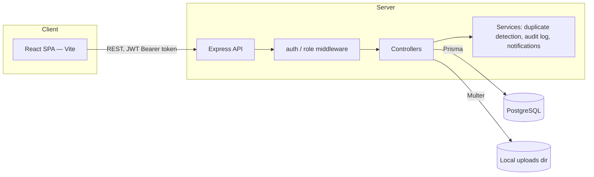
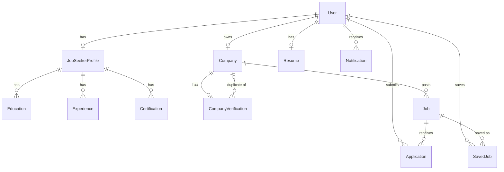
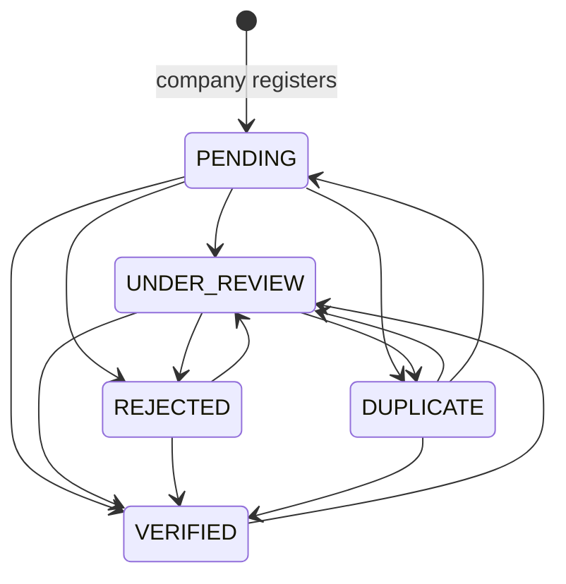
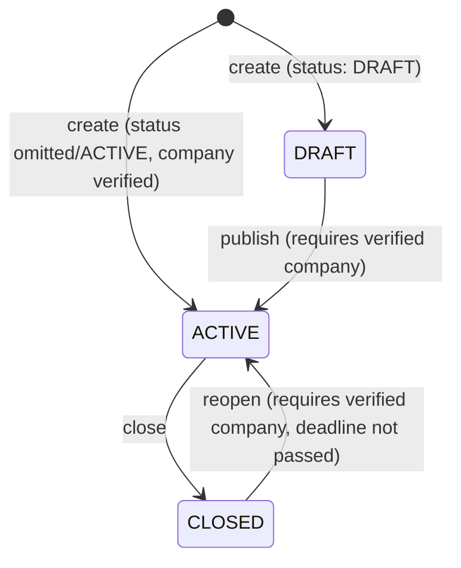
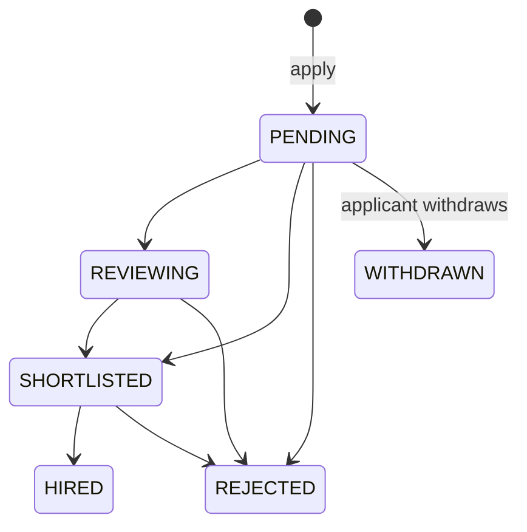

# Architecture

## System overview



The frontend is a single Vite-built React SPA served separately from the API; in development, Vite proxies `/api` to the Express server (`frontend/vite.config.js`). There is no server-side rendering and no separate BFF layer — the SPA talks directly to the Express API over JSON.

## Backend request flow

Every request passes through, in order: CORS → JSON body parsing → `standardizeResponses` (wraps every handler's `res.json()` call into a consistent envelope unless the handler already set one) → route-specific `authenticate` (JWT verify) and `requireRole(...)` middleware where required → controller → (for most writes) a `prisma.$transaction([...])` when more than one row must change atomically (e.g. a verification decision that updates `CompanyVerification`, flips `Company.isVerified`, writes an `AdminAuditLog` row, and creates a `Notification` all together) → global error handler.

### Response envelope

Every API response has the same shape:

```json
// success
{ "success": true, "message": "string", "data": { ... } }
// error
{ "success": false, "message": "string", "errors": [] }
```

Handlers can just call `res.json({ ...whatever })`; `standardizeResponses` middleware fills in `success`/`data` automatically if the handler didn't already set `success` explicitly. The frontend's Axios response interceptor (`frontend/src/services/api.js`) unwraps `data` on the way back into application code, so page components read fields directly (`profile.firstName`) rather than reaching through `response.data.data.profile.firstName`.

### Error handling

The global Express error handler (`backend/server.js`) translates known Prisma error codes into HTTP status codes rather than leaking raw database errors: `P2002` (unique constraint) → `409`, `P2025` (record not found) → `404`, `PrismaClientValidationError` → `400`. Stack traces are only included outside `NODE_ENV=production`. Unknown routes return a clean `404` JSON body, never Express's default HTML error page.

## Authentication & roles

- JWT (`{ userId }`, signed with `JWT_SECRET`, default 7-day expiry) issued on register/login, stored client-side via Zustand's `persist` middleware (`localStorage` key `auth-storage`) — this is the only place the frontend touches storage for auth state.
- Every request attaches `Authorization: Bearer <token>` via an Axios request interceptor.
- On app boot, the frontend calls `GET /api/auth/me` to re-validate the stored token against the server (catches revoked/expired sessions and deactivated accounts) before rendering any protected route; a full-page spinner covers this check so there's no flash of stale content.
- Roles are stored uppercase in Postgres (`Role` enum: `JOB_SEEKER`, `COMPANY`, `ADMIN`) but always returned to the frontend lowercased (`job_seeker`, `company`, `admin`), which is the convention the whole frontend uses (`frontend/src/utils/roles.js`'s `normalizeRole`, with alias mapping `employer`→`company`, `worker`→`job_seeker`).
- Public registration (`POST /api/auth/register`) only accepts `job_seeker`/`company` — `admin` is rejected with `400`. There is no admin self-registration or invitation flow; admin accounts must be created directly against the database.
- Role checks are enforced server-side (`backend/src/middleware/role.js`) on every protected route — frontend route guards (`ProtectedRoute`/`GuestRoute`) are a UX convenience only, never the actual security boundary.

### Password reset

`crypto.randomBytes(32)` generates the raw token; only its SHA-256 hash is stored (`PasswordReset.tokenHash`), with a 30-minute expiry and single-use enforcement (`usedAt`). `POST /api/auth/forgot-password` always returns the same neutral `200` message regardless of whether the email is registered, to avoid leaking account existence. The reset email is sent via `backend/src/services/emailService.js` (Nodemailer) when `EMAIL_HOST`/`EMAIL_USER`/`EMAIL_PASS` are configured; the SMTP connection is verified once at first use and logged. If SMTP isn't configured, development falls back to logging the reset URL server-side (gated behind `NODE_ENV !== 'production'`, never in the API response); in any other environment it logs `"SMTP configuration missing"` instead of silently pretending the email was sent. The same email service backs the public contact form (`POST /api/contact`), which forwards validated submissions to `CONTACT_INBOX_EMAIL`.

## Data model



Key models (see `backend/prisma/schema.prisma` for the authoritative field list):

- **User** — `role`, `isActive`, `notificationPreferences` (`Json?`).
- **JobSeekerProfile** — `firstName`/`lastName`/`title`, contact fields, `bio`, `linkedin`/`github`/`website`, `avatarUrl`, `resumeUrl`, `skills` (string array), plus child `Education`/`Experience`/`Certification` rows.
- **Company** — profile fields (`name`, `normalizedName`, `tagline`, `industry`, `foundedYear`, `email`, `phone`, `website`, `district`, `description`, `logoUrl`), `isVerified` (derived convenience flag, authoritative source is `CompanyVerification.status`), `status` (`CompanyStatus`: account standing — active/suspended/pending — unrelated to identity verification), `plan`.
- **CompanyVerification** — one row per company: `panNumber`, `registrationNumber`, document URLs, `status` (`VerificationStatus`: `PENDING`/`UNDER_REVIEW`/`VERIFIED`/`REJECTED`/`DUPLICATE`), `reviewNotes`, `reviewedById`, `duplicateOfCompanyId`.
- **Job** — content fields, `status` (`JobStatus`: `DRAFT`/`ACTIVE`/`CLOSED`), `isActive` (kept in sync with `status` as a derived boolean so existing public-listing queries didn't need rewriting), `deadline`. `EXPIRED` is not a stored value — it's computed at read/apply time from `deadline < now()`, since there's no background scheduler in this project.
- **Application** — unique on `(jobId, userId)`; `status` (`ApplicationStatus`: `PENDING`/`REVIEWING`/`SHORTLISTED`/`REJECTED`/`HIRED`/`WITHDRAWN`).
- **AdminAuditLog** — append-only (`adminId`, `action`, `entityType`, `entityId`, `oldValue`/`newValue` JSON snapshots, `reason`).
- **Notification** — `userId`, `type`, `title`, `message`, `data` (JSON), `readAt`.
- **Resume** — one per user, JSON columns for flexible sections (`personalData`, `experience`, `education`, `skills`, `projects`, `certifications`), validated/normalized at the API layer.
- **PasswordReset** — `tokenHash` (never the raw token), `expiresAt`, `usedAt`.

## Core workflow lifecycles

### Company verification



A company registers, then submits PAN/registration numbers and documents (`POST /api/company/verification`). An admin reviews via `/api/admin/companies/:id/{under-review,verify,reject,mark-duplicate,restore}` — every transition is validated against the table above (invalid transitions and same-status no-ops are rejected with a readable `400`/`409`), and each one atomically updates `CompanyVerification`, flips `Company.isVerified`, writes an `AdminAuditLog` row, and creates a `Notification` for the company owner, all inside one `prisma.$transaction`. `Company.isVerified` is only ever `true` while `status === VERIFIED` — it is explicitly cleared on every other transition, including a later rejection after a prior approval.

Before deciding, an admin can pull `GET /api/admin/companies/:id/duplicate-check`, which runs `companyDuplicateService.analyzeDuplicateRisk()` live: exact registration number, PAN, or website domain match contribute the most to the score; name similarity (Levenshtein-based, generic industry words like "Tech"/"Solutions"/"Nepal" stripped before comparing) and shared owner-email domain contribute less; same city or same industry alone never contribute. Risk is bucketed LOW (0–39) / MEDIUM (40–69) / HIGH (70–100) — the score is advisory only; the admin always makes the final call, nothing is auto-marked duplicate.

### Job lifecycle



A job defaults to `ACTIVE` on creation (matching normal job-board behavior) unless the caller explicitly requests `status: 'DRAFT'`. Publishing (creating as `ACTIVE`, or `PATCH /:id/publish`) is blocked server-side with `403` for any company that isn't `VERIFIED` — enforced in the controller, never trusted from the frontend. Deleting a job with existing applications is blocked (`409`) to protect applicant history; closing is the correct way to retire a job that has applicants.

### Application lifecycle



Applying is blocked if the job's deadline has passed (`400`) or the applicant has already applied (`409`, enforced by a unique constraint on `(jobId, userId)`). A company can only move an application along the allowed transitions above (`409` otherwise); every successful transition creates a `Notification` for the applicant in the same transaction as the status update. The applicant can withdraw at any point before a terminal state.

## File uploads

Multer handles multipart uploads (avatars, resumes, company logos, verification documents) to a local `uploads/` directory (`UPLOAD_DIR` env var), served statically and referenced by URL in the relevant model (`avatarUrl`, `logoUrl`, etc.) — no cloud storage integration exists in this project.

## Security controls

- Passwords hashed with bcrypt (cost factor 12); a shared password policy (min 8 characters, at least one letter and one number) is enforced server-side on register, reset, and change-password — never left to frontend validation alone.
- Every company-scoped and job-seeker-scoped query resolves ownership from `req.user.id` (JWT-derived), never from a client-supplied ID — cross-tenant reads/writes are structurally impossible, not just filtered.
- Admin actions require the `ADMIN` role server-side; there is no admin self-registration path.
- `.env` files are gitignored on both sides; `.env.example` files contain placeholder values only.
- Login and password-reset failure messages are intentionally generic (e.g. the same `401` message for a wrong email or wrong password) to avoid account-enumeration.

## Deployment considerations

This project currently targets local/single-instance deployment: local file storage for uploads, no background job scheduler, no caching layer beyond TanStack Query's client-side cache. An SMTP-based email service exists (`backend/src/services/emailService.js`) but ships unconfigured by default — set `EMAIL_HOST`/`EMAIL_PORT`/`EMAIL_USER`/`EMAIL_PASS`/`EMAIL_FROM` (and optionally `CONTACT_INBOX_EMAIL`) for password-reset and contact-form email to actually go out; without them the app degrades gracefully (dev-only console fallback for reset links, an explicit error for the contact form) rather than crashing or claiming false success. Deploying beyond local development would require, at minimum: swapping local file storage for an object store, configuring the email service against a real SMTP/provider, rotating `JWT_SECRET` and database credentials out of any example/dev values, and running Prisma migrations via `migrate deploy` in CI/CD rather than manually.

## Company subscription plans

Plan definitions (id, name, `monthlyAmount`/`yearlyAmount`, currency, features) live in one place, `backend/src/config/plans.js`, and are served by two endpoints: the public, read-only `GET /api/plans` (consumed by the marketing Pricing page) and the authenticated `GET /api/company/billing/plans` (consumed by the company Billing page). Both frontend pages fetch from these endpoints rather than hardcoding numbers, so pricing shown to a visitor and pricing shown to a signed-in company can't drift apart. `Company.plan` (the `PlanTier` enum) stores which plan a company is on; the actual price shown anywhere is always looked up from `plans.js` at request time.
